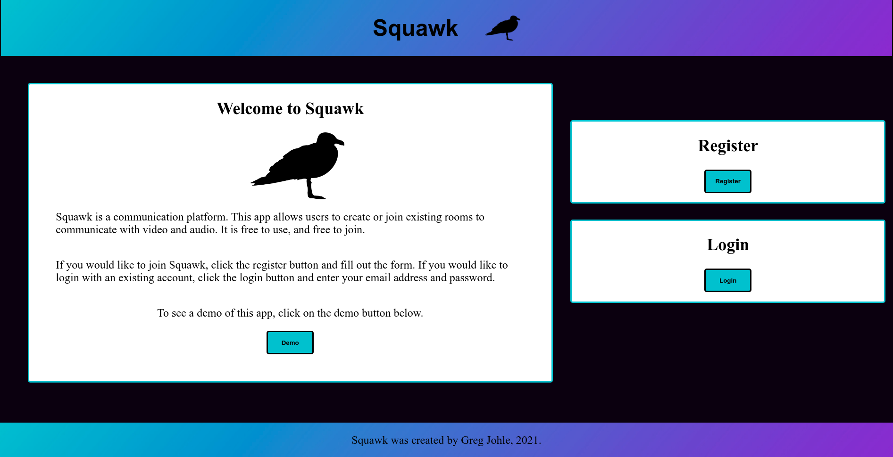
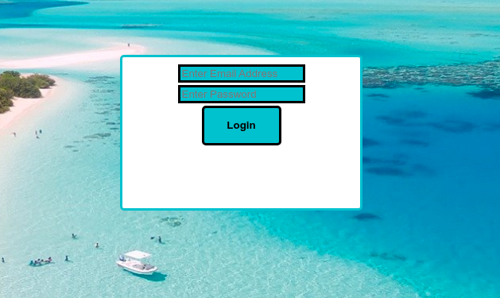
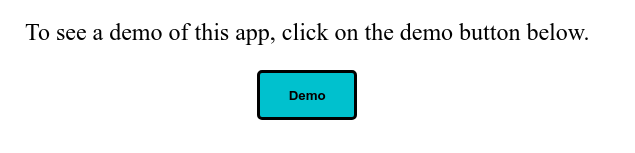
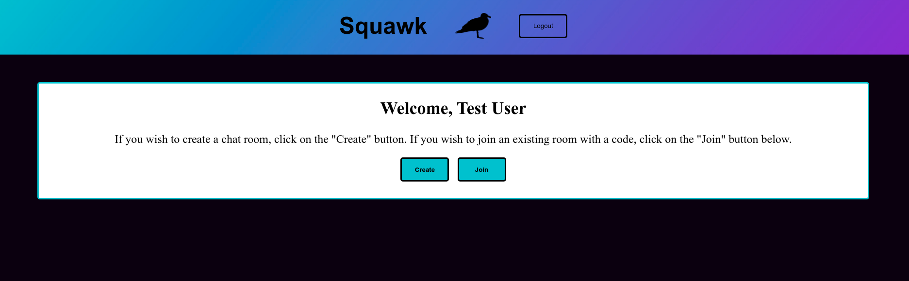
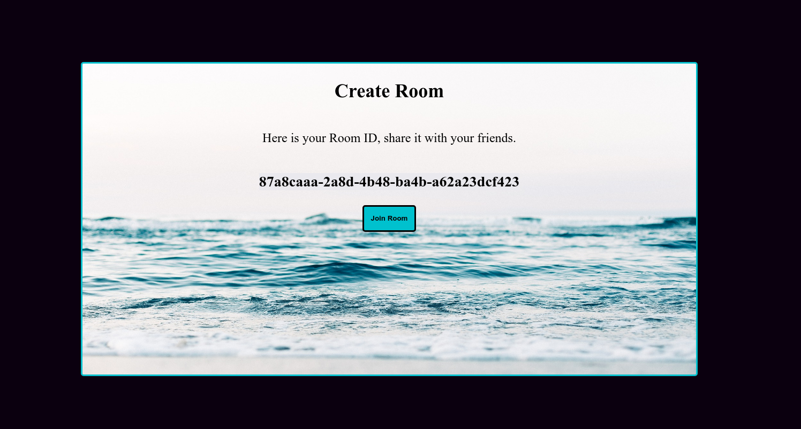
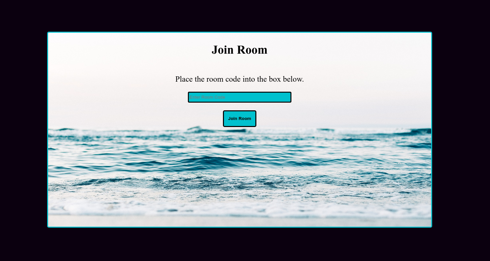

# Squawk

This project is a communication platform leveraging Socket.io and webRTC to allow users to communicate effectively and securely whenever they wish. This app is free to use.

## Live Demo

To see this app in action, click [here](https://squawk-client.vercel.app/)

## Squawk API

For more information on the Squawk API working behind the scenes, click [here](https://github.com/gregjohle/squawk-api/blob/main/README.md)

## Using Squawk

### The Landing Page

From this initial location, a user has the option to register for an account, login to an existing account, or utilize the demo account.

### Registration

By filling out this form, the Squawk API adds the user information into the back-end database.

### Login

A user can access an existing account through this form.

### Demo Account Login

This button fetches account information for the test account automatically.

### Dashboard

Once logged-in, a user has the option to create a new room, or access an existing room.

### Create Room

A room code is automatically generated from the UUID npm package installed within the project. By clicking on this code, it is automatically added to the clipboard for easy sharing.

### Join a Room

If a friend shares a room code with the user, they can access the room by placing the room code into this input field.

### Video Chat

Once both users are inside the room, a webRTC connection is established between both users. This is a secure, encrypted, peer to peer connection.

## Technology Used

This app was created with a full JavaScript stack, using the popular React framework on the front-end, and the Node.js framework on the back-end.

Front-end technology includes webRTC for video and audio communication.

Back-end technology inclues express, PostgreSQL, and socket.io (to establish a connection between users).

## Contact

If there are any questions, concerns, or issues, please feel free to contact Greg at greg.johle@gmail.com
